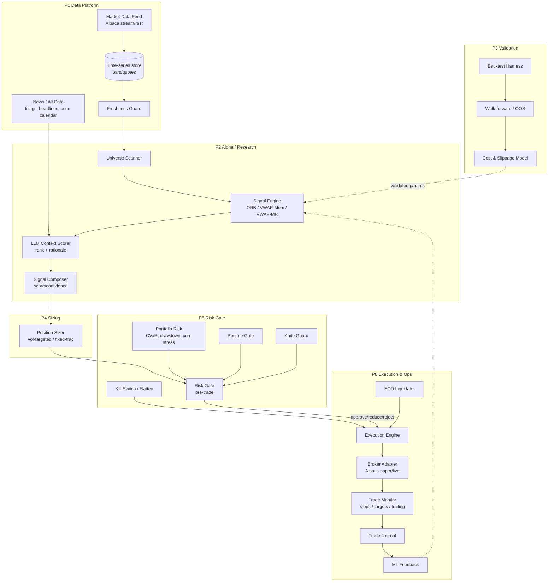

# Algo Day-Trading System with LLM — Design Document

Status: **Draft v1** — implemented in this repo (P0–P6 of
[`docs/INTRADAY_ALGO_IMPLEMENTATION.md`](docs/INTRADAY_ALGO_IMPLEMENTATION.md)); this document stays the design
basis for the research/LLM layer.
Scope: US equities, intraday (day-trading), single-account, paper-first then live.
Audience: builder/operator (single developer), future contributors.

---

## 0. TL;DR

Build a **deterministic pipeline** in which an LLM can *propose and enrich* trade ideas but can **never** touch the broker directly. The only path to an order is:

```
Market Data ──► Universe Scanner ──► Signal Engine ──► Risk Gate ──► Execution ──► Monitor ──► Journal
                     (rules)        (rules + LLM)      (MANDATORY)     (broker)    (stops)    (feedback)
```

Non-negotiables:

1. **The Risk Gate is mandatory and bypass-proof.** Every order intent passes through it or the order does not exist. The LLM layer has zero broker credentials.
2. **The LLM is an alpha filter / context scorer, not an order placer.** It emits structured `{direction, confidence, rationale, tags}`; rules and risk own the decision.
3. **Paper-first.** Live capital is gated behind a promotion checklist (Section 12).
4. **Everything is logged.** Every signal, gate decision, order, and fill is persisted for audit and retraining.

---

## 1. Goals & Non-Goals

### Goals
- Day-trade US equities with a small set of **well-understood, intraday-native strategies** (ORB, VWAP momentum, VWAP mean-reversion).
- Use an **LLM layer** to add context the pure-price rules can't see: news flow, earnings proximity, sentiment, sector regime, and "is this a trap?" reasoning.
- Enforce **portfolio-level risk** (CVaR, drawdown, correlation stress, regime gate, position limits) before any order reaches the broker.
- Provide a **trade journal + ML feedback loop** that turns realized outcomes into signal-quality input.
- Run end-to-end in **paper trading** (Alpaca paper) before any live deployment.

### Non-Goals (v1)
- Options, futures, crypto, FX, shorting hard-to-borrow names.
- Sub-second / HFT execution, colocation, order-book microstructure.
- Full autonomy: no unsupervised self-modifying strategy code.
- Multi-account / fund administration.
- Derivatives pricing infrastructure (not relevant to intraday cash equities).

---

## 2. The 6 Pillars of Quant Finance (synthesized model)

> **Note on sourcing:** There is **no single canonical, universally accepted "six pillars of quant finance."** Public framings differ — some use 3 pillars (data, model/alpha, execution), some 4 (strategy, backtest, execution, risk). The closest recurring **six-part system architecture** in the literature is: *data platform → research/alpha → backtesting/validation → portfolio construction → execution → risk/monitoring.*

This document adopts a **six-pillar model tailored to an intraday system**, which we treat as the spine of the architecture. Each pillar maps to a concrete subsystem in Section 4.

| # | Pillar | Question it answers | Fails when… | Primary subsystem |
|---|--------|---------------------|-------------|-------------------|
| **P1** | **Data Foundations** | Do I have clean, timely, point-in-time data? | Stale bars, survivorship bias, look-ahead leakage | Data Platform (§4.2) |
| **P2** | **Alpha / Research** | Do I have an edge? | Overfit signals, no economic rationale | Signal Engine (§4.4) + LLM (§5) |
| **P3** | **Validation & Backtesting** | Does the edge survive costs and out-of-sample? | Ignoring slippage, regime-specific overfit | Research Harness (§4.3) |
| **P4** | **Portfolio Construction & Sizing** | How big should each bet be, jointly? | Naive sizing, correlated concentration | Sizing module (§4.5) |
| **P5** | **Risk Management** | How do I survive being wrong? | No hard limits, no kill switch | Risk Gate (§4.6) |
| **P6** | **Execution & Operations** | Did the trade actually happen, at what cost? | Slippage, duplicate orders, no reconciliation | Execution + Monitor + Journal (§4.7–4.9) |

The **LLM layer (Section 5) is not a seventh pillar** — it is a *research/alpha enrichment component* living inside P2, with strict sandboxing: it produces ranked context, never orders.

Two supporting cross-cutting concerns wrap all pillars:
- **P0 — Infrastructure/Ops:** schedulers, secrets, queues, observability, reproducibility.
- **P0' — Governance/Compliance:** market-hours, wash sales, audit trail, model change control (the US PDT rule was retired 2026-06-04, replaced by the Intraday Margin Rule — see §10).

---

## 3. Design Principles

1. **Deterministic core, probabilistic advisor.** Rules and risk are deterministic and testable; the LLM is a scored input with a fallback when unavailable.
2. **Order intent as the contract.** Layers communicate via a typed `OrderIntent` object; the LLM never emits one directly.
3. **Fail closed.** If data is stale, the gate errors, or the LLM times out → **no trade**. Never "assume OK."
4. **Idempotency everywhere.** Client-generated `intent_id` prevents duplicate submission on retry.
5. **Simulation-first parity.** The same strategy/gate code path runs in backtest and live; only the data source and broker adapter differ.
6. **Everything observable.** Structured logs + metrics + a persisted journal from day one.
7. **Boring, auditable over clever.** Prefer explicit rules to learned black boxes for gates.

---

## 4. System Architecture

### 4.1 High-level component diagram



### 4.2 P1 — Data Platform

**Responsibilities:** ingest, normalize, store, and serve market + context data with strict freshness guarantees.

**Sources (v1):**
| Type | Source | Notes |
|------|--------|-------|
| Live quotes/trades | Alpaca streaming (IEX on free tier) | Stream preferred over REST polling for intraday. |
| Historical intraday bars | Alpaca bars (minute aggregated from trades) | Free tier: IEX-based, ~15-min historical lag; paid → SIP. |
| Daily/prior-close | Alpaca daily bars | Needed for gap % and reference levels. |
| Corporate/econ calendar | Calendar API | Earnings dates, FOMC, CPI — feeds event avoidance. |
| News headlines | News API | Timestamped for point-in-time correctness. |

**Rate limits to design around:**
- Alpaca Trading API: ~200 req/min/account; paper and live accounts are metered separately.
- Alpaca market data (free): ~200 req/min, IEX-only, limited window; streaming has symbol-channel limits.
- Implication: **prefer streaming + local caching**; never let a strategy hot-poll REST bars.

**Storage:**
- Hot store: on-disk columnar / Parquet per session for bars and quotes (append-only).
- Metadata: SQLite/Postgres for instruments, sessions, corporate actions, signal/decision journal.
- All records carry an **`as_of` timestamp** to enforce point-in-time joins (no look-ahead).

**Freshness Guard (fail-closed):**
- Each instrument has a max staleness budget (e.g., 2s for live quotes during session; 60s for 1-min bars).
- Stale beyond budget → instrument is quarantined for the cycle; no signals emitted.

**Session calendar:** RTH 09:30–16:00 ET; pre/post handling; half-days; halts. All scheduling keys off exchange calendar, not wall-clock.

### 4.3 P3 — Validation & Backtesting

**Purpose:** prove an edge survives realistic costs *before* it is allowed into the signal engine.

**Framework selection** (from research):
| Framework | Style | Best for | Chosen role |
|-----------|-------|----------|-------------|
| **vectorbt** | Vectorized, Numba | Fast parameter sweeps, signal research | **Primary research tool** |
| **Backtrader** | Event-driven, bar-by-bar | Discretionary-style prototyping, teaching | Secondary / sanity cross-check |
| **QuantConnect LEAN** | Event-driven, C#/Py | Backtest→live single stack | Candidate for live-parity if we outgrow in-house |
| **NautilusTrader** | Event-driven, Rust core | Deterministic, execution-realism | Candidate for production-grade execution |

**Decision (v1):** Research in **vectorbt** (speed), *validate* in an **event-driven simulator we own** (boring, transparent, and shares the exact `OrderIntent`/gate code path as live). Reserve LEAN/NautilusTrader as an upgrade path if execution realism becomes the bottleneck.

**Backtest requirements (hard bars):**
- **Costs mandatory:** commission + spread + **slippage model**. Breakout entries fill at *next tradable price + slippage*, not the trigger price. Mean-reversion is highly cost-sensitive.
- **Bias controls:** point-in-time universe, no look-ahead, survivorship-free instrument list, corporate-action adjustment.
- **Regime stratification:** report trend-day vs range-day separately per setup.
- **ORB windows tested separately** (5/15/30 min) — never mixed.
- **Minimum sample:** ≥50 trades per setup before any conclusion.
- **Walk-forward + OOS holdout.** No parameter is promoted on in-sample fit alone.
- **Promotion gate:** setup enters `Signal Engine` only with positive OOS expectancy *after costs* and stable parameter surfaces.

### 4.4 P2 — Signal Engine (Alpha)

**Universe Scanner:** pre-session, filter a liquid US universe by: price band, avg dollar volume, ATR/volatility floor, gap %, earnings-today exclusion (configurable), spread cap, shortability if shorting.

**Intraday setups (v1):**

| Setup | Regime | Entry | Filters | Exit |
|-------|--------|-------|---------|------|
| **ORB Momentum** | Strong open, expanding volume | Close beyond opening-range high/low | Holds beyond VWAP; above-avg volume | Opposite OR side / trailing stop / target |
| **VWAP Momentum (pullback)** | Trend day, pullback | Pullback to VWAP then continuation | Trend direction intact | Prior swing / VWAP breach / time exit |
| **VWAP Mean-Reversion** | Choppy / overstretched | Fade stretch away from VWAP | Low ADX / range regime; RSI/BB extreme | Revert to VWAP / mean |

**Opening-range discipline:** avoid the first N minutes (the Alpaca momentum example uses a 15-min opening avoidance) — configurable; default avoids first 15 min.

**Signal Composer output** (feeds sizing + gate):
```
Signal {
  symbol, setup, direction, raw_score, confidence,   # rule-derived
  llm_adjustment, llm_rationale, llm_tags[],          # from §5
  regime, features_snapshot_as_of, valid_until
}
```

### 4.5 P4 — Position Sizing

- **Volatility-targeted sizing** as default: risk per trade = f(ATR / recent realized vol), capped by % of equity.
- **Fixed-fractional** fallback for simplicity/testing.
- **Portfolio-aware:** total simultaneous risk bounded; new position size reduced to respect remaining portfolio risk budget.
- Optional **Kelly-fraction cap** (fractional Kelly, never full) once edge estimates are stable.
- Sizing emits a proposed **quantity + notional** inside the `OrderIntent`; the Risk Gate may **reduce** it.

### 4.6 P5 — Risk Gate (MANDATORY, bypass-proof)

**Contract:** `OrderIntent → {ALLOW | REDUCE | BLOCK}` with a reason code and a `binding_gate`. Nothing moves without an ALLOW.

**Pre-trade checks (all must pass):**
- Max **notional** / max **shares** per order.
- Max **position** size per symbol (% equity).
- Max **gross & net exposure**, leverage cap.
- **Concentration** limits (per symbol, per sector).
- **Correlated exposure** limit (cluster risk).
- **Symbol/asset allowlist** and **session/halt status**.
- **Market-hours** check; **no new entries after cutoff** (EOD-flat policy).
- **Stop-loss required** — an entry without a defined stop is rejected.
- **Daily loss limit** / **max trades per day** (anti-overtrading).

**Portfolio risk modules:**
- **Portfolio CVaR** — tail-risk budget across open + proposed positions.
- **Drawdown control** — intraday and rolling drawdown thresholds throttle/reject.
- **Correlation stress** — shocks to correlated clusters (e.g., same sector beta) evaluated jointly.
- **Regime gate** — risk-on/off; blocks mean-reversion in strong trends and blocks breakouts in dead ranges.
- **Knife guard** — blocks catching falling knives: reject mean-reversion entries against a strong adverse impulse / news shock / halt-resume.

**Kill switch / flatten mode:**
- Manual and automatic triggers (daily loss breach, data integrity failure, broker error storm).
- Flatten = cancel working orders + market-close positions; requires explicit re-arm.

**The LLM never sees broker credentials and cannot call the gate's ALLOW path.** It only contributes to the signal score.

### 4.7 P6 — Execution

- **Broker Adapter interface** abstracts venue (v1: Alpaca paper, then Alpaca live; IBKR as future adapter).
- **Idempotent submission:** client `intent_id`; retries safe; duplicate-suppression at the adapter.
- **Order types:** marketable-limit / resting-limit entries (**never market**); protective stop + target placed as a **bracket / OCO** immediately after entry fill.
- **Sequence:** submit entry → confirm fill → place stop + target → register with monitor. Partial fills handled explicitly.
- **Cutoff:** no new entries after configurable time (e.g., 15:45 ET); all positions flat by close.
- **Reconciliation:** local order/position state periodically reconciled against broker state; divergence alerts.

### 4.8 Trade Monitor

- Tracks each open position: stop, target, trailing stop, time-stop.
- Reacts to fills/rejects/partials; re-places protective orders if missing (with reconciliation guard).
- **EOD Liquidator:** guaranteed flat by session end; verifies with broker.

### 4.9 Journal & ML Feedback

- **Trade Journal:** every signal, gate decision, order, fill, exit, P&L, costs, and the LLM rationale that was in force.
- **ML Feedback loop:** realized outcomes become labels for a signal-quality / meta-labeling model (which setups under which regimes were profitable). This is **offline and supervised** — it feeds research, never live-code self-modification.
- **Post-trade analytics:** expectancy by setup/regime, slippage vs model, hit rate, drawdown attribution, LLM-adjustment value-add (does LLM agreement correlate with P&L?).

---

## 5. LLM Subsystem Design

### 5.1 Role
- **Context scorer / alpha filter** (per the "LLM as alpha miner/filter" pattern), *not* an autonomous trader.
- Inputs: point-in-time headlines, filings highlights, econ calendar, sector/relative-strength snapshot, the rule-based signal.
- Outputs: a bounded adjustment to the signal score + human-readable rationale + tags (e.g., `earnings_soon`, `halt_risk`, `sector_rotating`, `squeeze_risk`).

### 5.2 Contract (structured output only)
```
LLMContext {
  symbol,
  direction_bias: BULL | BEAR | NEUTRAL,
  confidence: 0.0..1.0,
  score_adjustment: -1.0..+1.0,      # bounded; cannot flip a signal alone
  tags: string[],
  rationale: string,                  # max N tokens
  as_of, model_id, prompt_version
}
```
- Free-form text can **never** become an order. A schema validator rejects malformed output → falls back to rule-only score.
- `score_adjustment` is **bounded and weighted**; the LLM cannot create a trade where rules found none, nor invert a rule direction (configurable, default: cannot flip).

### 5.3 Guardrails & metrics
- **Timeout + fallback:** LLM unavailable → rule-only scoring continues; no trade is ever *blocked* by LLM failure, and no trade is *created* by it either.
- **Cost/latency control:** cache per symbol per session; batch; only call on symbols that already passed the rule filter (not the whole universe).
- **Prompt/version pinning:** every decision records `prompt_version` + `model_id` for reproducibility and A/B testing.
- **Evaluation:** offline eval of LLM adjustment vs realized P&L; kill the LLM contribution if it fails to add value after costs.

### 5.4 Multi-agent option (future)
A TradingAgents-style desk (fundamental/news/technical analysts + bull/bear debate + risk) is a **candidate v2**, but only after the single-scorer loop proves value. Multi-agent adds latency and cost; not justified for v1 intraday cadence.

---

## 6. Key Data Structures / Interfaces

**OrderIntent** (the pipeline contract):
```
OrderIntent {
  intent_id            # idempotency key (client-generated)
  symbol, side, qty, order_type, limit_price?, stop_price?, target_price?
  setup, signal_score, confidence
  llm_rationale_ref?
  created_at, valid_until
  origin               # rule | llm_enriched | manual
}
```

**GateDecision:**
```
GateDecision {
  intent_id, verdict: ALLOW | REDUCE | BLOCK,
  reason_code, adjusted_qty?, binding_gate,
  portfolio_snapshot_ref, decided_at
}
```

**Fill** and **Trade** records persisted to journal.

---

## 7. Technology Stack (proposed)

| Concern | Choice | Rationale |
|---------|--------|-----------|
| Language | Python 3.11+ | Ecosystem for data/ML/brokers. |
| Market data + broker | Alpaca (paper → live) | Free tier, paper trading, stream + REST. |
| Research/backtest | vectorbt (+ own event-driven sim) | Speed + live-parity control. |
| Storage | Parquet (bars) + SQLite/Postgres (metadata/journal) | Simple, portable, auditable. |
| LLM | Hosted API, structured output | No local model ops in v1. |
| Scheduling | Session-calendar-aware scheduler | RTH/half-days/halts. |
| Observability | Structured logs + metrics + alerts | Incident response, audit. |
| Config | Versioned YAML + typed schema + env secrets | No secrets in code. |
| Testing | pytest for deterministic core; recorded-data replay for strategies | Reproducibility. |

---

## 8. Reference Projects (study, do not fork wholesale)

From the GitHub survey and follow-up research:

| Project | Why reference it | Take / don't take |
|---------|------------------|-------------------|
| **Alpaca Momentum-Trading-Example** (~711★/223 forks) | Canonical intraday momentum + Alpaca execution; 15-min opening avoidance, +4% gap, ORB, MACD, volume, stop/target, EOD liquidation | Take the **strategy parameters + execution discipline** as one intraday module. |
| **ShortCircuit** | Architecture mirrors ours: ingestion → freshness → sequential gates → sizing → execution → stops → monitoring → reconciliation → audit → ML feedback | Take the **pipeline shape + reconciliation discipline**. |
| **Algo-Trader** (~866★) | Realtime + backtest + custom strategies + TA | Study **architecture/plugin boundaries**. |
| **Lumibot Algorithms** | US-stock day trading with Alpaca/IBKR, minute data | Study **strategy/backtest/execution separation**. |
| **Catalyst** (~2.6K★) | Large historical/minute-data ecosystem | Study data pipeline; **crypto-oriented, don't adopt**. |
| **AI Scalpel Trading Bot** (~454★) | ML strategy optimization | Study **optimization workflow**; not the crypto part. |
| **FinMem / TradingAgents / AlphaAgent (FLAG-Trader)** | 2024–25 LLM agent literature: layered memory, multi-agent desk, alpha mining, LLM+RL | Informed the **LLM-as-filter** and **future multi-agent** decisions. |
| **NautilusTrader / LEAN** | Deterministic, production-grade execution/backtest-parity | Candidate **execution upgrade path**. |

**Caveat from the literature:** most reported LLM-trading returns come from *backtests/simulations*, often lacking comparable protocols and realistic costs. Treat headline alpha claims skeptically; demand OOS + cost-inclusive validation.

---

## 9. Operations

- **Daily lifecycle:** pre-market scan → open (avoid first N min) → intraday signal/gate/execute loop → monitor → cutoff → **EOD flatten** → post-close reconciliation + journal + report.
- **Failure modes:** stale data → quarantine; broker error storm → kill switch; gate exception → fail closed; LLM timeout → rule-only.
- **Alerting:** data staleness, duplicate orders, unfilled protective stops, reconciliation mismatch, daily-loss breach.
- **Replay:** every session replayable from recorded data for post-mortems and regression tests.

---

## 10. Compliance & Regulatory Notes

- **PDT rule (US) — retired 2026-06-04:** superseded by the Intraday Margin Rule (IML/IMD). Day-trade counting is not implemented and must **not** be built; sizing respects the IML/IMD state instead.
- **Wash-sale rule:** avoid re-entering a name within 30 days after a loss if it affects tax accounting (matters for the journal).
- **Market hours / halts:** no orders outside RTH; respect LULD halts.
- **Audit trail:** decisions, prompts, model versions, and orders are persisted.
- **Secrets:** API keys via env/secret store; the LLM layer holds **no** broker credentials.

---

## 11. Phased Roadmap

| Phase | Deliverable | Exit criteria |
|-------|-------------|---------------|
| **0 — Foundations** | Data platform + session calendar + freshness guard + storage | Clean, point-in-time bars/quotes; stale data quarantined. |
| **1 — Research** | Strategy research + validation harness (vectorbt + own sim) + cost model | ≥1 setup positive OOS *after costs* over multiple regimes, ≥50 trades/setup. |
| **2 — Signal Engine** | ORB + VWAP-Mom + VWAP-MR + universe scanner + composer | Deterministic signals reproduced in replay. |
| **3 — Risk Gate + Sizing** | Full gate, portfolio risk (CVaR/drawdown/corr/regime/knife), kill switch | Gate proven bypass-proof; every order has a decision record. |
| **4 — Execution (paper)** | Alpaca paper adapter, monitor, EOD liquidator, reconciliation | End-to-end paper session flat-by-close, reconciled, journaled. |
| **5 — LLM Layer** | Context scorer + structured schema + eval | Offline eval shows value-add vs rule-only; safe fallbacks verified. |
| **6 — Feedback** | Journal analytics + meta-labeling loop | Signal quality measurable by setup/regime; loop feeds research. |
| **7 — Live (guarded)** | Tiny-capital live with hard caps + kill switch | Promotion checklist met; live performance consistent with paper. |

---

## 12. Live Promotion Checklist (gates before real capital)

- [ ] ≥ N paper sessions with clean reconciliation and flat-by-close.
- [ ] OOS, cost-inclusive positive expectancy per active setup.
- [ ] Risk gate verified: kill switch tested; daily-loss breach flattens.
- [ ] Stale-data and broker-error fail-closed paths tested.
- [ ] LLM layer proven optional (system trades correctly with it disabled).
- [ ] Hard capital cap + manual re-arm on kill switch.
- [ ] Observability + alerting live; on-call runbook written.

---

## 13. Open Decisions (to resolve before Phase 1)

1. **Universe size & shorting:** long-only liquid large/mid caps, or include small caps + shorts?
2. **LLM provider/model and budget** (latency per signal matters intraday).
3. **Execution framework:** stay in-house (own event-driven sim + Alpaca adapter) vs adopt NautilusTrader/LEAN for live parity.
4. **Storage:** SQLite (simplicity) vs Postgres (concurrency) for the journal.
5. **LLM influence bound:** should `score_adjustment` be able to *veto* a rule signal, or only nudge the size? (Default: nudge only.)
6. **Risk-per-trade default** and daily-loss limit numbers.

---

## Appendix A — Glossary

- **ORB** — Opening Range Breakout.
- **VWAP** — Volume-Weighted Average Price; intraday trend/pullback reference.
- **ADX** — Average Directional Index; trend-strength gauge used for regime.
- **CVaR** — Conditional Value-at-Risk; expected loss in the tail.
- **OCO** — One-Cancels-Other bracket (stop + target).
- **EOD flat** — No positions carried overnight.
- **PDT** — Pattern Day Trader rule (US; retired 2026-06-04, superseded by the Intraday Margin Rule).
- **Meta-labeling** — Secondary model that decides *whether to act* on a primary signal.

## Appendix B — References
- Alpaca momentum day-trading example — https://github.com/alpacahq/Momentum-Trading-Example
- ShortCircuit (NSE, architecture reference) — https://github.com/nabrahma/ShortCircuit
- Algo-Trader — https://github.com/idanya/algo-trader
- Lumibot Algorithms — https://github.com/FranklineMisango/Lumibot_Algorithms
- Catalyst — https://github.com/scrtlabs/catalyst
- AI Scalpel Trading Bot — https://github.com/hackobi/AI-Scalpel-Trading-Bot
- PROFIT (NAACL, RL + financial text) — https://github.com/midas-research/profit-naacl
- Alpaca API rate limits & market data docs — https://docs.alpaca.markets
- Backtesting framework comparisons (vectorbt / Backtrader / LEAN / NautilusTrader) — public 2026 comparisons.
- LLM trading-agent literature: FinGPT, FinMem, TradingAgents, AlphaAgent/FLAG-Trader (2024–25 surveys).