# Two-Sleeve Algo Intraday Execution — Design

Status: **Draft v1 (design only, no code)** · 2026-09-12 · audience: owner/builder (single operator), future contributors.

Digests [`../DESIGN.md`](../DESIGN.md) (algo day-trading system with LLM) and the workspace-level
[`../../Master_deign.md`](../../Master_deign.md) (research-aware execution system, hard invariants) into one
design: **two sleeves under one house risk gate**, fed by the research layer but *shippable alone*.

Companion: [`INTRADAY_ALGO_IMPLEMENTATION.md`](INTRADAY_ALGO_IMPLEMENTATION.md) — components, contracts, phases, tests.

> Not financial advice. Nothing in this document places an order. The shipped state of this repo is the signal
> daemon plus the paper order path; the switches default ON (owner decision 2026-09-13) — but an order still
> requires the caller's `execute=True`, and `live` requires two independent opt-ins. Every phase below is gated.

---

## 0. What this design decides

| # | Decision | Why |
|---|---|---|
| D1 | **Two sleeves, one gate.** `value-dip` (swing, fed by research) and `intraday-algo` (self-signalled) never size or spend capital independently. | The pasted brief: *"do not allow the two strategies to compete for capital blindly."* One portfolio, two engines. |
| D2 | **Capital ceilings are per sleeve; the risk budget is global.** Default 70/30 capital, but allocation is a *risk* decision, not a fixed split. | A 70/30 capital split at 3× vol difference is a ~39/61 variance split; the intraday sleeve would carry 61% of portfolio risk on 30% of the capital [C1][C2]. |
| D3 | **The house risk gate sits above both sleeves** and is the only component that can emit `ALLOW`. | CVaR / drawdown / correlation stress / vol regime / knife guard / market regime exist already in the research stack; the execution layer reimplements them on its own data so both sleeves are judged by one verdict source [M1][C1]. |
| D4 | **Opportunity and permission are orthogonal, machine-readable fields.** | The brief: `HOLD` hides whether valuation or portfolio risk said no. `opportunity_score` (producer-owned) + `trade_permission`/`binding_gate` (gate-owned) make that explicit. |
| D5 | **Total separation by construction:** no shared code, no shared interpreter, no cross-repo imports, own `.env`, own vendor keys, own data subscriptions. Interaction is artifact drop + signed HTTPS API + MCP. | Owner instruction; also the only way the boundary is enforceable by CI instead of discipline [I1][I2]. |
| D6 | **The LLM proposes, the gate disposes, the human approves.** No LLM-authored number ever sizes, prices, or gates a trade. | OWASP LLM06 "complete mediation"; SEC 15c3-5(c)(1)(ii) pre-trade controls; the Knight Capital failure was exactly a missing pre-trade control [L1][L2][L4]. |
| D7 | **The intraday sleeve is an experiment with a pre-registered kill criterion, not an assumed earner.** | Base rate: 97% of persistent Brazilian day traders lost money; <1% of Taiwanese day traders are predictably profitable; replicated intraday strategies have median Sharpe 0.05 with 44% negative [E1][E2][A3]. |
| D8 | **Validation is pre-registered and cost-inclusive; the 2026-01-02→2026-09-11 window cannot prove sleeve superiority.** | With Sharpe ≈0.9 vs 1.6 and ρ≈0.15, the ΔSR t-stat is ≈ −0.45; t=2 needs ≈3,500 sessions (~14 years) [V1][V2]. |

---

## 1. Objectives, invariants, non-goals

### 1.1 Objectives

1. Turn research-layer **analysis** into bounded, mandate-gated, auditable **action** at Alpaca, with an
   intraday capability the research layer does not have.
2. Run **two sleeves in parallel for 3–6 months** on the same broker account and measure which produces more
   return per unit of risk **after realistic costs** — not which makes more money.
3. Keep the research layer **advisory**: it may inform, it may never instruct, and it holds no broker key.
4. Keep the execution layer **shippable alone**: `git clone TradingExecution && pip install && run` must work
   with no sibling repo present.

### 1.2 Hard invariants (never compromised)

| Invariant | Enforcement |
|---|---|
| Research is advisory; execution is committed | No order path in any component that reads research text; the only order path is the gate. |
| **Fail closed** | Any check that cannot run → no order. Broker error envelopes are failures, never successes. |
| No lookahead | Decisions bind to `effective_date`; fills model the next tradable price; the intraday sleeve never sees a bar it could not have seen (data vintage stamped per read). |
| Deterministic numbers | Every size, price, and gate verdict is a pure function of typed inputs. LLM output is text + bounded advisory scores only. |
| One computation | Risk numbers come from one place (the house gate). No sleeve recomputes its own copy to get a different answer. |
| No blind competition for capital | Per-sleeve capital ceilings + one sizer + one gate; a same-symbol conflict is resolved before submission, not at the broker. |
| Honest degradation | Missing data → quarantine + `unavailable`, never a placeholder number. |

### 1.3 Non-goals (v1)

Market-making, HFT, colocation, sub-second latency; options/futures/crypto/FX; shorting hard-to-borrow names;
multi-account or fund administration; autonomous strategy self-modification; derivatives pricing; a second broker.
Order routing to IBKR/Robinhood stays the M4+ path in [`../../EXECUTION_IMPLEMENTATION_PLAN.md`](../../EXECUTION_IMPLEMENTATION_PLAN.md).

---

## 2. System context and the research↔execution boundary

```mermaid
flowchart LR
    subgraph R["TradingAgents (research, advisory)"]
        RA[LLM analyst desk + debate] --> RD[research_decision.json<br/>+ run_card.json]
        RR[risk governor<br/>CVaR / drawdown / regime] -.->|advisory risk context| RD
    end

    subgraph X["TradingExecution (committed) — ships alone"]
        INB[inbox + dedupe] --> ROUTE{sleeve router}
        ROUTE --> SW["sleeve A: value-dip (swing)"]
        ROUTE --> IN["sleeve B: intraday-algo"]
        IN --> HG
        SW --> HG["HOUSE RISK GATE<br/>CVaR · drawdown · correlation stress<br/>vol regime · knife guard · market regime<br/>sizing policy · mandate"]
        HG --> SZ[one sizer + sleeve budgets]
        SZ --> EX[execution policy<br/>child orders · brackets · synthetic stops]
        EX --> BR[Alpaca paper/live]
        BR --> REC[reconcile → ledger → journal → scorecard]
        REC -.->|measured sleeve metrics| ALLOC[allocation manager]
        ALLOC -.->|ceiling / throttle| HG
    end

    RD -->|artifact drop| INB
    X -->|signed HTTPS + MCP, read/propose only| R
    MCP[MCP clients / LLM agents] -->|read-only + propose| X
```



### 2.1 The three layers and what each may do

| Layer | Owns | May not |
|---|---|---|
| **Research** (`TradingAgents`) | LLM analysis, vendor keys for research data, report artifacts | Emit orders, hold broker keys, be imported by execution |
| **Web** (`trading_web`) | Read-only presentation | Trade, mutate mandate, hold broker keys |
| **Execution** (`TradingExecution`) | Mandate, gate, sizing, orders, ledger, sleeve accounting | Read prose as an input, reuse research code, expose mutating MCP tools without approval |

### 2.2 Independence requirements (the separation contract)

1. **No shared code.** No `import tradingagents`, no vendored copy of its modules, no shared package. CI fails the
   build on a cross-repo import [I1].
2. **No shared runtime.** Own interpreter/venv (`py -3.12`), own dependency pins (hash-checked), own OS service.
3. **Own `.env`.** Keys the execution layer needs are **copied** into `TradingExecution/.env` (and preferably into
   the OS keystore, not a file). The research repo's `TRADINGAGENTS_*` variable names are **not** a supported
   input: the current `_TAGENT_ALPACA_PREFIX` alias in `signald/config.py` is a boundary leak to remove [I5].
4. **Own data providers and clients.** `alpaca-py`, the market-data subscription, the calendar package, and any
   news/vendor client are execution-side dependencies with execution-side keys.
5. **Three interaction surfaces only:**
   - **artifact drop** (research → execution): the durable, replayable, retryable hand-off of
     `research_decision.json` + `run_card.json`; idempotency key = `producer.run_id` + artifact hash.
   - **signed HTTPS control API** (execution ↔ research/web): status, sleeve budget, risk state, proposal
     submission. HMAC-SHA256 request signing, 300 s replay window, role-scoped keys (see §12.4).
   - **MCP** (agents/LLM): read-only tools plus a *propose* tool; mutating tools off by default, each requiring a
     gate verdict and a human approval token [I2][I4].
6. **Fail-isolated shipping.** Either repo can be released, restarted, and rolled back alone; the execution layer
   degrades to "no new research-driven signals" (never to "no risk checks") when the research layer is absent.

### 2.3 What crosses the boundary (and what never does)

| Crosses | Direction | Form |
|---|---|---|
| Research decision (rating, direction, targets, stops, thesis, invalidation, data quality, advisory risk context, artifact hash) | research → execution | versioned JSON artifact, schema-validated, expiry-bound |
| Signal / sleeve state / gate verdict / fills / risk state | execution → research/web | signed read API + `signals.jsonl` + `latest.json` |
| Proposal from an LLM (symbol, side, intent, bounded rationale) | agent → execution | MCP `propose_order` → **pending proposal**, no broker effect |
| Approval | human → execution | single-use approval token bound to the proposal hash |
| **Never** | — | free prose as a decision input, broker keys in the research process, research code in the order path, LLM-authored numbers |

---

## 3. Sleeve architecture

### 3.1 The two engines

```text
                         STOCK UNIVERSE
                     ┌──────────┴───────────┐
                     │                      │
              VALUE-DIP ENGINE        DAY-TRADE ENGINE
              (swing, research-fed)   (intraday, self-signalled)
                     │                      │
              fundamentals/value      momentum / VWAP / ORB /
              technicals/momentum     gap / reversion + day type
                     │                      │
                     └──────────┬───────────┘
                                ▼
                         HOUSE RISK GATE          ← CVaR · drawdown · correlation
                                ▼                     stress · vol regime · knife
                         PORTFOLIO MANAGER            guard · market regime
                                ▼
                       SLEEVE BUDGETS + ONE SIZER
                                ▼
                        EXECUTION POLICY → ALPACA
```

### 3.2 Sleeve A — `value-dip` (swing)

| Aspect | Design |
|---|---|
| Input | `ResearchDecisionV1` artifact (rating/direction → action, `target_weight`, stop, target, invalidations, data quality, thesis ref) |
| Cadence | decision-driven (typically one research run per symbol per day); entries/exits evaluated at the next tradable session per the no-lookahead rule |
| Horizon | days–weeks; **owns overnight exposure** |
| Sizing | research `target_weight` is a *request*; the sizer applies the house risk budget, sleeve ceiling, vol target, and per-name cap |
| Exits | stop (caliber-checked), target, thesis invalidation, guardrail downgrade (a research downgrade can only reduce) |
| Authority | a research artifact may never raise exposure above the mandate or the sleeve ceiling; `guardrail_reason`/risk-cap is a ceiling, not a floor [M1] |
| Failure mode | stale/unknown data quality → refuse the order (fail closed), never "assume OK" |

### 3.3 Sleeve B — `intraday-algo` (day trade)

| Aspect | Design |
|---|---|
| Input | Its own market data (real-time SIP quotes/trades) + its own signal engine; may read research artifacts as **context only** (regime tag, sector rotation) |
| Cadence | intraday, event-driven on 1-min bars/quotes; hard time gates (see §6.3) |
| Horizon | minutes–hours; **flat by close, no overnight state is representable** |
| Setups | RVOL-filtered 5-min opening-range breakout; VWAP pullback continuation (trend day); VWAP mean reversion (range day); gap-go / gap-fade with explicit opposing signs |
| Sizing | one sizer; per-trade risk as % of **sleeve** equity, capped by sleeve ceiling and house heat |
| Exits | structural stop (synthetic, never naked stop-market), target/time stop, EOD flatten |
| Authority | the sleeve proposes; the house gate approves; the sleeve can never widen a limit |
| Failure mode | stale quotes, halt, spread blow-out, cost-gate failure → no trade |

### 3.4 Why the two sleeves should be structurally uncorrelated

This is the entire point of running both:

- US equity returns accrue mostly **overnight** (close→open) while intraday sessions are much flatter, and the
  two components have **opposite signs for several anomalies** — momentum accrues overnight, several others
  intraday [A6][A7].
- The overnight drift itself has **died post-2021** (the 02:00–03:00 ET window averaged ≈3.7% p.a. before, ≈0
  since; pre-cost Sharpe 1.1 → post-cost −0.5) [A8].
- Consequence: sleeve A rents **overnight/valuation** risk; sleeve B rents **intraday momentum/volatility** risk.
  The combination is a diversification claim that must be **measured**, not assumed (§11.6).

### 3.5 Anti-blind-competition rules (D2/D5 made operational)

| Rule | Statement |
|---|---|
| R1 | Every sleeve has a **capital ceiling** (default 70/30). Unused intraday capital is not silently lent to the swing sleeve: it returns to the reserve. |
| R2 | The **house gate runs before any sleeve-level sizing**, and its verdict is final. |
| R3 | **One sizer** for the whole book; a sleeve submits a *risk request*, not a quantity. |
| R4 | **Same-symbol conflict:** if both sleeves want the same symbol on the same day, the house gate resolves priority (swing thesis wins by default; intraday gets a reduced or zero allocation) and the trade is **netted before submission** — Alpaca rejects self-crossing orders as potential wash trades (HTTP 403) [L6]. |
| R5 | **Global stress correlation:** combined VaR/CVaR uses a stress correlation (≈0.8–0.9 for correlated long-equity clusters), not the calm-period estimate (≈0.1) — correlations rise in bear markets, and "all correlations go to 1" is an exaggeration to be replaced by a measured cluster assumption [C3][C4][R1]. |
| R6 | **Reallocation is slow and evidenced:** thin only inside bands, and only after the pre-registered review cadence — never intraday, never on a hot streak. |
| R7 | **Kill/shrink criteria are pre-registered** and mechanical (§7.6), so the decision to stop is not made in a drawdown. |

---

## 4. The house risk gate and the two orthogonal verdicts

### 4.1 Gate inputs

| Input | Source | Notes |
|---|---|---|
| Order intent (symbol, side, intent, requested risk, setup, sleeve) | sleeve | typed only |
| Book state (positions, fills, working orders, realized PnL today, sleeve ledgers) | execution ledger + broker reconcile | **fills** are the source of truth for exposure |
| Risk state (equity, buying power, IML/IMD state, margin call state) | Alpaca account + local margin model | account-wide credentials are broker-enforced account-wide; the sleeve split is enforced **here** [I6][G1] |
| Market state (vol regime, realized/implied vol, spread, halt/LULD state, SSR, calendar) | execution data layer | freshness-stamped |
| Research risk context (**advisory**) | `research_decision.json` | regime tag, research CVaR estimate, `risk_gate` verdict + reasons; never authoritative |
| Mandate (universe, caps, leverage, approval mode, expiry) | signed mandate file | fail closed on expiry |

### 4.2 Gate checks (all fail-closed, all named)

| # | Check | Blocks / reduces when | Binding-gate name |
|---|---|---|---|
| G1 | mandate | symbol not allowed (**entries only** — a reduce/exit of a provably held name is exempt; unknown holdings keep the block), mandate expired, leverage/daily-count breach | `mandate` |
| G2 | sleeve ceiling | sleeve notional would exceed its capital ceiling | `sleeve_capital` |
| G3 | portfolio CVaR / ES | projected 1-day 97.5% ES of the book > budget | `house_cvar` |
| G4 | drawdown | rolling/intraday drawdown beyond the de-risking ladder rung | `house_drawdown` |
| G5 | correlation stress | projected stress-correlation cluster exposure > cap | `correlation_stress` |
| G6 | vol regime / vol target | realized vol above target → scale size down (never up beyond cap) | `vol_regime` |
| G7 | knife guard | mean-reversion entry into a strong adverse impulse / news shock / post-halt reopen | `knife_guard` |
| G8 | market regime | strategy–regime mismatch (breakout in a dead range, reversion in a strong trend) | `market_regime` |
| G9 | concentration | per-name / per-sector / cluster caps | `concentration` |
| G10 | liquidity & participation | order > participation cap of recent volume; spread blow-out | `liquidity` |
| G11 | cost gate | expected edge < k × round-trip cost (k=3) | `cost` |
| G12 | time gate | outside the allowed entry window; after the EOD cutoff; halt active | `time` / `halt` |
| G13 | data quality | stale/mixed caliber/unknown vintage | `data` |
| G14 | wash/trade-through/shortability | self-cross with the other sleeve, SSR/ETB violation, shorts disabled | `wash` / `shortability` |
| G15 | approval | size ≥ threshold in `manual-high-order` mode | `approval` |

Verdict = `ALLOW` | `REDUCE` (with the reducing check named and the adjusted size) | `BLOCK` (with the **first**
binding gate in precedence order, plus all reasons). Precedence is deterministic and documented — a `BLOCK` must
never be reported with a vague reason.

### 4.3 `opportunity_score` vs `trade_permission` (D4)

The brief's complaint — *"HOLD hides useful information"* — is fixed by making the two questions separate fields
that travel together on every signal:

| Field | Owner | Meaning |
|---|---|---|
| `opportunity_score` (0–100) | the producer (research for A, signal engine for B) | "how attractive is this setup on its own merits?" — valuation, momentum, technicals, risk *of the name* |
| `trade_permission` | **the house gate** | `ALLOW` / `REDUCE` / `BLOCK` |
| `binding_gate` | the house gate | the single check that decided it (`house_drawdown`, `house_cvar`, …) |
| `permission_reason` | the house gate | human-readable + machine code |

So the answer to *"why no BUY?"* is never `HOLD`:

| Case | `opportunity_score` | `trade_permission` | Reads as |
|---|---|---|---|
| Attractive, portfolio forbids | 84 | `BLOCK` | "good opportunity, **your book** is not allowed to take it — binding gate: portfolio drawdown" |
| Unattractive, portfolio fine | 31 | `ALLOW` (or `BLOCK` via `cost`) | "the book is fine; this idea isn't good enough" |
| Both bad | 22 | `BLOCK` | "not attractive **and** not permitted — two independent reasons" |
| Both good | 88 | `ALLOW` → sized | normal case |

Rules: the producer may never set `trade_permission`; the gate may never raise `opportunity_score`; a research
artifact whose `opportunity_score` is high while permission is blocked must still be **recorded and reported**
(the "report card of the reports" pattern in [`../../Master_deign.md`](../../Master_deign.md) §7).

---

## 5. Sleeve A — value-dip engine detail

### 5.1 Input contract

`ResearchDecisionV1` (additive from today's `schema_version: 1`, see the implementation doc §2):

- action from `direction` (add/hold/reduce/exit) else `rating` mapping (existing behaviour, preserved);
- `target_weight` / `target_notional` = a **request** subject to the gate;
- `stop_loss` / `take_profit` (caliber-tagged), `invalidations[]` (a live breach suppresses the decision);
- `data_quality ∈ {fresh, stale, partial, unknown}` — anything but `fresh` is refused unless the mandate
  explicitly allows `partial`, and the refusal is audited;
- `opportunity_score` (new, producer-owned), `regime`, `risk_context` (advisory CVaR/regime from research);
- envelope: `schema_version`, `idempotency_key`, `produced_at`, `expires_at`, `producer{service, git_sha, run_id}`,
  `artifact_sha256`.

### 5.2 Swing-specific policy

| Policy | Value / rule |
|---|---|
| Entry | next tradable session after the decision's `effective_date`; no chasing beyond a limit band |
| Exit | stop (native or synthetic stop-limit), target, invalidation breach, or a research downgrade |
| Overnight | allowed and expected — this sleeve is the overnight-return engine |
| Per-trade risk | 0.5–0.75% of **house** equity, capped by sleeve budget [R1] |
| Max concurrent | 8 swing positions, ≤12 total across sleeves [R1] |
| Concentration | single name ≤10% of house equity (swing) / ≤5% (intraday); ≤25% of 20-day ADV per order; ≤25% of sleeve notional per correlated cluster |
| Stop type | synthetic stop-limit (never a naked stop-market) |
| Approval | any order ≥ `approval_threshold` requires operator approval in `manual-high-order` mode |

---

## 6. Sleeve B — intraday algo engine detail

### 6.1 Universe scan (pre-session)

Filters, all executed on the execution layer's own data: price > \$5; 14-day ADV > 1M shares; 14-day ATR > \$0.50;
tradable + shortable if needed; earnings-today exclusion (configurable); spread cap; exclude names in halt/LULD
reopen. This is the filter set the most-cited ORB work uses [A1][A2].

### 6.2 Day type, then setup (the classifier comes first)

| Classifier output | Measure | Action |
|---|---|---|
| Opening drive | first-5-min RVOL ≥ 2.0 and rank in the day's top 20 | ORB eligible [A1][A2] |
| Trend vs range | ADX(14) > 25 = trend; < 20 = range; 20–25 = no trade | trend → VWAP pullback; range → VWAP reversion [A4] |
| Range/compression | overnight range < 25% of ATR (trend lean) / > 60% (range lean) | context, not a trigger [A4] |
| Gap bucket | \|gap\| < 0.3× ATR → fade candidate; ≥ 4% + RVOL ≥ 3× → go candidate; \|gap\| > 1.2× ATR → **no fade** | [A5][A9] |
| Regime gate | vol regime + market regime from the house gate | a breakout in a dead range is blocked (`market_regime`) |

### 6.3 Setups (v1) — with the evidence attached honestly

| Setup | Entry | Stop | Exit | Evidence status |
|---|---|---|---|---|
| **ORB, RVOL-filtered** | break of the 5-min opening range, only on top-20 RVOL names, entry window 09:35–11:00 ET | 10% of 14-day ATR / structural swing | 10R base or trailing; **flat by cutoff** | Headline 2016–2023 backtest (Sharpe 2.81) is **REPORTED and contested**: independent replication of the broader rule gives Sharpe ≈ −0.06, and index-ETF ORB shows no raw edge (−1.8/−3.5 bps drift) [A1][A3] |
| **VWAP pullback (trend day)** | pullback to VWAP/AVWAP that holds, with ADX > 25 | 1.5–2.0× ATR (stop-limit) | prior swing / VWAP breach / time stop | Practitioner convention; no peer-reviewed track record in US cash equities [A4] |
| **VWAP reversion (range day)** | stretch to outer band with ADX < 20 | 1.5–2.0× ATR | revert to VWAP | Vendor win-rate claims (54–72%) are unverified; do not size off them [A4] |
| **GAP_GO** | status quo gap ≥ 4%, RVOL ≥ 3×, above the first-15-min high, rising MACD | last swing low − \$0.01 or −5% | 3R target + MACD exit | Alpaca example thresholds, verified in its source; **not** a validated strategy [A9] |
| **GAP_FADE** | \|gap\| < 0.3× ATR only | above the opening high | revert to prior close | NQ study: 77.8% fill for tiny gaps vs 8.2% for > 1.2× ATR (futures, non-peer-reviewed) [A5] |

Explicitly **not** shipped: raw index-ETF ORB; generic HOD/LOD breakouts; overnight-hold intraday variants;
first-half-hour→last-half-hour momentum (dies out-of-sample) [A3][A8].

### 6.4 Non-negotiable intraday disciplines

| Discipline | Rule |
|---|---|
| Opening avoidance | `no_entry_before = 09:35 ET` (first 5 minutes have the widest spreads — ≈24 bps at the open vs ≈13 bps by 09:40 — and ~3× average volatility) [A4][X1] |
| Entry cutoff | `no_entry_after = 11:00 ET` (mechanical cut); midday breakouts are low-participation and fade more often |
| Flatten | `flat_by = 15:50–15:55 ET`, verified against the broker; the intraday sleeve cannot represent an overnight position |
| Max trades/name/day | 1 |
| Stops | **synthetic stop-limit** (internal trigger → marketable limit with a hard max-deviation cap); naked stop-markets are prohibited (1–5 bps normal, 10–60+ bps in fast markets) [X2] |
| Halts | a halt/LULD state machine: no entries while halted; after a reopen, no new entry for a cooldown; existing positions are managed per the halt policy (never blind-market orders into a reopening auction) [X3] |
| Shorts | only if the mandate allows, only ETB names, respecting SSR (short-sale restriction triggers at −10% from prior close and lasts the rest of that day plus the next) [X3] |
| Cost gate | require `expected_move_bps > 3 × round_trip_cost_bps`; round trip ≥12 bps liquid, ≥30 bps low-float [X2][E3] |
| Data | real-time SIP only for live decisions; IEX-only or 15-min-delayed data is research/backfill-only. A `data_vintage` field is stamped on every signal [X4] |

### 6.5 Honest expectations (why the kill criterion exists)

| Fact | Number | Implication |
|---|---|---|
| Retail day traders who lose money | 97% of those who persist >300 days (Brazil, futures); <1% predictably profitable net of fees (Taiwan) | the default assumption is that this sleeve loses |
| Replicated intraday strategies | median Sharpe 0.05 vs 0.37 for the whole catalogue; 44% negative | treat any backtest Sharpe as inflated until DSR/PBO says otherwise |
| Post-publication decay | ≈26% out-of-sample / ≈58% post-publication; worst where trading is expensive | intraday is the most exposed family |
| Realistic cost floor | 10–15 bps round trip for liquid large caps; 25–60 bps for small/low-float | 1,000 round trips/yr at 10 bps = 100% of the sleeve's capital in cost |
| Honest ceiling for a competent operator | ≈5–15% net CAGR at Sharpe ≈1.0 after costs; live ≈50–70% of backtest | the sleeve must clear this bar after costs or be shrunk/killed |

[C1][E1][E2][E3][E4][V1]

---

## 7. Capital allocation, risk budgets, and reallocation

### 7.1 Capital split is a risk decision

A 70/30 *capital* split is not a 70/30 *risk* split. With a 3× vol difference the intraday sleeve carries ≈39/61
of portfolio variance on 30% of the capital; the equal-risk-contribution (ERC) target for 10% vs 30% vol sleeves is
≈75/25 [C1][C2]. The design therefore specifies **both**:

| Knob | Default | Notes |
|---|---|---|
| Capital ceiling A (swing) | 70% | hard ceiling enforced by `sleeve_capital` |
| Capital ceiling B (intraday) | 30% | hard ceiling; unused B capital goes to **reserve**, not to A |
| Vol target A | 10% annualized | sleeve-level vol targeting |
| Vol target B | 10% annualized (notional-scaled intraday) | same target, different horizon |
| Risk budget (1-day 97.5% ES) | sleeve ≤1.5% of **sleeve** equity; **house ≤1.0% of total equity** | FRTB's capital metric is 97.5% ES; ES is hard to estimate in small samples, so use parametric + EWMA + a stress grid, never historical-ES alone [R1][R4] |
| Market beta cap | intraday sleeve net long beta ≤1.3× NAV; house net beta ≤1.0× | crash-correlation regime [C3] |
| Max portfolio heat | 3% of equity at risk across open positions | hard cap |
| Max positions | 5 intraday + 8 swing, ≤12 total | |

### 7.2 Sizing pipeline (one sizer, four gates)

```text
sleeve risk request (in R, not shares)
   → per-trade risk cap (0.25% intraday / 0.5–0.75% swing)
   → sleeve risk budget remaining
   → house heat + CVaR check
   → vol-target scalar (size ∝ target_vol / realized_vol, clamped ≤1.5×)
   → liquidity/participation cap
   → final quantity  (never rounded up; never widened)
```

Fractional Kelly is an **input** (half-Kelly at most, with shrinkage toward zero on estimation error), never a
standalone sizer; two sleeves must not each Kelly-size independently (that is how the book ends up past 2× Kelly,
where continuous-time excess growth ≈ 0) [C1][R1][R2].

### 7.3 Reallocation policy

| Rule | Value |
|---|---|
| Cadence | monthly review; adjustments only at month boundaries |
| Trigger for tilt | trailing 6-month OOS evidence of a higher risk-adjusted contribution, with the interval clearing the noise bar (§11) |
| Band | ±10 percentage points per review, floor 15% / ceiling 85% for a live sleeve |
| Never | intraday reallocation, reallocation on a hot streak, reallocation during an active drawdown |
| Cash reserve | `min_cash_reserve_usd` honoured house-wide before any sleeve may size up |

### 7.4 Correlation and stress policy

| Item | Rule |
|---|---|
| Combined risk | computed with a **stress correlation ≈0.8–0.9 among correlated long-equity names** (never 1.0, never the calm-period ≈0.1): correlation rises in bear markets and downside correlation runs ≈11.6% above normal-implied [C3][C4][R1] |
| Tail dependence | assume the sleeves co-drawdown in a market-wide shock; the ladder (§7.5) is portfolio-wide |
| Diversification claim | must be **measured** (correlation of daily sleeve PnL, co-drawdown incidence, tail dependence) before any capital is tilted (§11.6) |

### 7.5 Drawdown control (path-independent ladder)

| Rung | Trigger | Action |
|---|---|---|
| 1 | soft daily loss −1% of house equity | stop new intraday entries for the session; swing unaffected |
| 2 | hard daily loss −3% | flatten intraday sleeve; no new entries until next session; page |
| 3 | 5-day −6% or peak-to-trough −10% | both sleeves de-risk 50%; allocation frozen |
| 4 | −15% peak-to-trough | full halt, flatten, manual re-arm required |

Recovery takes ≈3× the time it took to build the drawdown (Triple Penance), so rungs de-risk *early* and
re-risk *slowly*; losing-streak circuit breakers that re-arm quickly are explicitly rejected [R2].

### 7.6 Pre-registered kill / shrink criteria (for the intraday sleeve)

Evaluated at the end of the 3–6-month parallel program (and monthly after):

1. **Kill** if, after costs, the sleeve's net expectation is ≤0 with ≥100 trades and the 95% bootstrap interval for
   expectancy excludes the backtest-predicted value (i.e. live is not a draw from the validated distribution).
2. **Kill** if the sleeve's contribution to portfolio CVaR grows while its contribution to return does not.
3. **Shrink** to 10% if the sleeve is positive but its risk-adjusted contribution is below the swing sleeve's with
   a clear interval.
4. **Keep/grow** only on evidence that survives §11 (DSR ≥ 0.95, PBO ≤ 0.05, paired comparison interval).
5. Sunk cost is irrelevant: the criterion is computed from the journal, and the decision is executed mechanically.

---

## 8. Execution and cost model (both sleeves)

### 8.1 Cost hierarchy at our size

At USD 5k–50k child orders (<0.05% ADV) the **spread dominates**: marketable ≈6–12 bps one-way vs passive ≈0–3 bps
for a $10k mid-cap order; whole-order impact is ≈`10,000 × Y × σ_daily × √(Q/V)` bps with Y ≈ 0.5–1.0, i.e. policy
choice beats schedule optimisation at this size [X2][X5][X6].

| Decision | Rule |
|---|---|
| Breakout entries (alpha decays fast) | marketable limit (accept the spread; cap the deviation) |
| Mean-reversion entries (alpha is the spread) | resting limit at/inside VWAP, cancel if unfilled by the time stop; **never** market |
| Exits | marketable limit with a deviation cap; flatten uses the closing auction when possible |
| Liquidation venue | prefer the closing auction where eligible (≈8.2 bps vs 9.3 bps at 1% ADV in one study) [X2] |
| Participation | cap at a fraction of trailing volume; large orders are sliced (child-order policy), never dumped |
| Fees | SEC §31 on sells, FINRA TAF per share, CAT/consolidated fees passed through and modelled — paper trading models none of them. **The 2026 sources disagree on the exact rates** (one vendor schedule shows SEC ≈$20.60/M and TAF $0.000195/share; another shows $0.0000278/$ and TAF $0.000166/share capped at $8.30, and one secondary source claims the SEC fee went to zero in May 2025) — read the broker's own fee schedule at implementation time and pin the version [X7][X8][G2] |
| Expected-cost band | published on every signal (half-spread baseline scaled by size), as Phase A already does |
| Paper parity | paper fills are NBBO-simulated with ~10% random partials and **no** impact/latency/queue model → paper success never validates live [X7] |

### 8.2 Order types and brackets

- Entries: limit / marketable limit; brackets (OTO/OCO) only where the platform permits — extended hours and
  overnight accept **limit + day|gtc only**, brackets forbid `extended_hours`, and notional/fractional orders are
  DAY-only and cannot be shorted or bracketed [X9].
- Protective stops: native where legal and safe, otherwise **synthetic** (internal trigger → marketable limit);
  a stop must exist before or with the entry, never "we'll add it later".
- Precision: ≥$1 → 2 decimals; <$1 → 4 decimals (sub-penny rejects) [X9].
- Idempotency: deterministic `client_order_id = f(sleeve, decision_hash|signal_id, leg)`; on timeout **query
  before retry**, never blind resend; a "not found" is reconciled, never assumed safe [X10].

---

## 9. Data platform (execution-owned)

| Need | Requirement |
|---|---|
| Live quotes/trades | streaming SIP (or the best available real-time feed) for decisions; IEX-only/delayed data is not decision-grade [X4] |
| Historical intraday | 1-min bars **and** quote/trade data for cost realism; bar-only backtests understate spread cost |
| Daily/prior close | gap %, ATR, RVOL baselines, prior-close reference |
| Corporate actions | splits/dividends — an unadjusted price series silently corrupts ATR/RVOL and stops |
| Calendar | exchange sessions, half days, DST, halts — a code-shipped calendar package, not a web lookup [L7] |
| Clock | host clock within 50 ms of a NIST source (FINRA Rule 4590); NTP configured and monitored [L7] |
| Freshness | per-instrument staleness budget; stale → quarantine the instrument for the cycle |
| Provenance | every record carries `as_of` + `feed` so a decision can never cite data it could not have had |
| Cost | Basic/free tiers are insufficient for live decisions; the cheapest real-time full-SIP retail path is a paid subscription (≈$99/mo) [X4] |

---

## 10. Risk limits — the default table

Every number below is a **default to be overridden by the owner**, not a claim of optimality; each is sourced or
derived in the research corpus [R1].

| Parameter | Default | Notes |
|---|---|---|
| Vol target (per sleeve) | 10% annualized | Harvey et al. report Sharpe 0.40 → 0.48–0.51 with vol targeting (equity/credit) at ≈1 bp/notional cost [R1][R3] |
| Vol estimator | EWMA, 20-day half-life on 5-min returns, zero-mean, ≥270-day warm-up | intraday-realizable |
| Leverage cap | 1.5× (margin account; 4× intraday buying power available but **not** used) | IML/IMD is the binding reality [G1] |
| Per-trade risk | 0.25% intraday / 0.5–0.75% swing | of house equity |
| Max portfolio heat | 3% | open risk across all positions |
| Max positions | 5 intraday / 8 swing / 12 total | |
| Single-name cap | 10% of house equity (swing), 5% intraday | plus sector/cluster caps |
| CVaR / ES budget | sleeve ≤1.5% of sleeve equity; house ≤1.0% of total equity, 1-day 97.5% ES | FRTB-style ES, not VaR [R1][R4] |
| ES estimation | parametric + EWMA-ES + historical-ES + **stress grid** (gap, halt, +200% vol); never historical-ES alone | ~6 tail observations/year at 250 days is statistically meaningless on its own [R1][R4] |
| ES / VaR backtest window | ≥500 days (2× the 250-day VaR backtest) | ES cannot be backtested directly; use VaR-violation traffic lights + severity tests [R1][R4] |
| Vol warm-up | ≥270 trading days of history before any vol-scaled size is allowed | Harvey et al. require 270 days (≥3 half-lives of the slowest estimate) [R3][R1] |
| Vol-target cap | scaled size capped at 1.5× (hard cap 2.0×) | uncapped inverse-variance scaling produced a 99th-percentile weight of 6.4× — the "leverage ratchet" [R1][R2] |
| Rebalance band | act only on a >10–15% relative move in target size, or on a scheduled cadence; no continuous intraday re-targeting | cost is near-linear in turnover; intraday cadence multiplies the drag [R1] |
| Stop distance | max(1.5–2.0× ATR(14), the 80th-percentile Maximum Adverse Excursion for that setup); never <1.0× ATR | stops bound loss size; tighter stops are **not** a universal expectancy improvement (they help only under momentum) [R1] |
| Stop placement | never at round numbers, prior-day high/low, or LULD band edges; cluster-proximity check required | stop clusters become predictable market flow [R1][X3] |
| Halt policy | no new entries within ±5 min of a limit state; positions marked at the band edge (not last trade); no chasing the reopening auction; if halted in the last 10 min, no re-open occurs | LULD mechanics [X3][R1] |
| Soft daily loss | −1% of house equity | stop new intraday entries (swing unaffected; rung 1 of §7.5) |
| Hard daily loss | −3% | flatten intraday sleeve, no new entries until next session, page |
| De-risk triggers | −6% over 5 days, or −10% peak-to-trough | rungs 3–4 of §7.5 |
| Flatten time | 15:50–15:55 ET, verified | no overnight intraday state |
| Buying-power guard | reserve ≥25% of the 4× intraday buying power; never plan fills at the ceiling | IML/IMD deficits cure within 5 business days or the account freezes 90 days [G1][R1] |
| Approval threshold | per mandate (`manual-high-order`) | operator approves before submission |

Two honest caveats on this table:

- **Vol targeting is proven at daily/monthly sampling, not intraday.** The Sharpe improvement (0.40 → 0.48–0.51) is measured on daily data with a 10% target across 60+ assets; the intraday-estimator variant is explicitly exploratory ("slightly improves"). The intraday sleeve uses the same machinery because the *tail* benefit (vol-of-vol 4.6% → 1.8%, smaller left-tail shortfall and drawdown) is the robust part — not because a Sharpe lift is promised [R1][R3].
- **Stops do not universally improve expectancy.** Kaminski & Lo's condition for a stop to add value is a positively autocorrelated process (ρ ≥ the strategy's Sharpe); under a random walk a stop lowers expected return. Stops are used here to **bound loss size and make risk budgeting possible**, and their distance is calibrated to each setup's Maximum Adverse Excursion distribution — never tightened because "tighter feels safer" [R1].

---

## 11. Validation: how we will know if either sleeve works

### 11.1 The uncomfortable arithmetic

- Under the null, N trials already inflate the best backtest: 500 trials → expected max Sharpe ≈1.5 before skill
  exists. Gate on **Deflated Sharpe ≥0.95 AND PBO ≤0.05**, and **log the trial count N** — a backtest without N is
  unfalsifiable [V1][V3].
- Minimum backtest length ≈ `2·ln(N)/(SR*)²`: at 5 trials and Sharpe 1, ≈1.4 years of data are needed [V4][L2].
- Comparing a 0.9-Sharpe swing sleeve to a 1.6-Sharpe intraday sleeve over ~175 sessions (2026-01-02→2026-09-11):
  ΔSR t-stat ≈ −0.45; t=2 needs ≈3,500 sessions (~14 years) [V2].

**Therefore:** the 2026 window is a **feasibility and cost study**, not a winner-declaration. It is still exactly
the right first step — same universe, same capital, same costs, trade-for-trade — because it will surface cost
drag, execution slippage, turnover, capacity, and operational defects long before statistics can.

### 11.2 Validation protocol (pre-registered)

| Step | Requirement |
|---|---|
| Data | point-in-time, survivorship-free universe; intraday bars + quotes; corporate-action adjusted |
| Leakage control | purged K-fold + embargo; no feature window spanning the close; labels non-overlapping |
| Trials | every parameter variation logged in a `trial_registry` (N is a first-class output) |
| Gates | DSR ≥ 0.95, PBO ≤ 0.05, ≥50 trades/setup, ≥6 months OOS, cost-inclusive |
| Costs | spread + impact (sqrt law) + fees + borrow modelled; paper fills never used as evidence |
| Regime stratification | trend vs range days reported separately; no mixing |
| Significance | HAC/Newey-West t-stats; effective sample size adjusted for intraday autocorrelation |

### 11.3 Sleeve comparison (the brief's metric list, operationalised)

Report per sleeve and for the combination, net of costs:

`Net CAGR · Sharpe · Sortino · Calmar · Max Drawdown · Profit Factor · Win Rate · Avg Win/Avg Loss ·
Expectancy per trade · Turnover · Slippage (vs model) · Commission+Fees · Exposure · Capital utilization · CVaR`
— with **Return / Max Drawdown** as the headline comparison, plus **Ulcer index**, **tail ratio**, and
**capacity** (the size at which edge → 0).

### 11.4 Paired comparison, not aggregate Sharpe

Two sleeves on the same universe/period/capital are compared **trade-for-trade**: paired stationary bootstrap on
the daily PnL difference, Diebold-Mariano for forecast pairs, McNemar for hit/miss agreement, and White's Reality
Check / Hansen SPA when many variants are tried. Aggregate Sharpe comparison alone is not evidence [V2][V5].

### 11.5 Diversification evidence (before any capital tilt)

| Test | Bar |
|---|---|
| Correlation of daily sleeve PnL | report the interval, not a point estimate; expect ≈0.1 calm |
| Stress correlation | recompute on the worst decile of market days; size on ≈0.7 |
| Co-drawdown incidence | fraction of days both sleeves are in drawdown |
| Tail dependence | joint exceedance of the 5% worst days vs independence |
| Combination Sharpe | must exceed both sleeves' Sharpe with an interval that excludes the better sleeve |

### 11.6 Promotion ladder

`research → backtest (gates above) → paper (≥1 clean month, reconciled, flat-by-close) → tiny live (hard caps,
kill switch armed) → scaled live (only after the pre-registered review)`. Any rung can be failed; failures are
recorded and cost nothing but time.

---

## 12. Governance, LLM and MCP surface

### 12.1 LLM role in this stack

The research layer's LLM desk stays where it is (advisory research). Inside execution, an LLM may:
classify/rank/cite, explain a gate verdict, summarise a session, and **propose** an order as a pending proposal.
It may not: compute a size, price or stop; set `trade_permission`; hold broker credentials; call a mutating tool
without a gate verdict and a human approval token [L1][L2][L4].

### 12.2 Controls

| Control | Detail |
|---|---|
| Schema-enforced outputs | structured/constrained output with deterministic re-validation; refusal/short-finish are failures, not partial results [L5] |
| No numeric authority | the decision record has no `qty`/`price`/`stop` fields the LLM can author [L4] |
| Untrusted market text | news/filings are **data**; delimiters + data/instruction separation; provenance ids the LLM cannot mint; no auto-fetched links/images into the model context [L8][L9] |
| Complete mediation | authorization lives in the gate and the API, never in the model's judgment [L1] |
| Human-in-the-loop | mutating tools and regime changes (allocation edits, live promotion) require an operator approval token bound to the proposal hash |
| Budgets | per-call and per-day token/cost ceilings; rate limits with jittered backoff [L3] |
| Red teaming | prompt-injection regression suite in CI; tool descriptions hash-pinned; MCP servers loopback-bound and authenticated [L3][L10] |

### 12.3 MCP tool surface (least privilege)

| Tool | Class | Approval | Notes |
|---|---|---|---|
| `get_account_state`, `get_positions`, `get_open_orders`, `get_signal_latest`, `get_risk_state`, `get_sleeve_allocation` | read | no | read-only hints; no credentials in arguments |
| `simulate_order` | dry-run | no | returns the **full** gate evaluation (verdict, binding gate, projected ES/drawdown) with no broker effect — the LLM's only way to test an idea |
| `propose_order` | write-intent | no | writes an immutable pending proposal keyed by hash; cannot fill |
| `submit_order(proposal_id, approval_id)` | mutating | **yes + gate verdict** | proposal hash must match; disabled by default |
| `cancel_order` | mutating | yes | |
| `halt_trading` | safety | allowed always | kill switch is never gated |
| `set_sleeve_allocation` | config | **yes** | operator-only |

### 12.4 Control-API auth (boundary spec)

`X-Key-Id` + `X-Timestamp` + `X-Nonce` + `X-Signature`, where
`Signature = HMAC-SHA256(secret, METHOD ‖ PATH ‖ SHA256(body) ‖ timestamp ‖ nonce ‖ key_id)`; 300 s replay window,
single-use nonce inside the signed material, constant-time verify, generic 401 on failure, deny-by-default
role-scoped keys (`read` / `propose` / `execute`), keys in the OS keystore (never git, never a checked-in `.env`),
rotation ≤12 months [I2][I3].

### 12.5 Audit record (hash-chained, append-only)

`event_id · ts_utc · channel(file|api|mcp|webhook) · actor_id · actor_role · action · args_hash · idempotency_key ·
signature_verified · policy_id · gate_verdict · binding_gate · approval_id · outcome · reason_code ·
broker_order_id? · prev_hash · hash` [I2][L7].

---

## 13. Operations

| Concern | Design |
|---|---|
| Daily lifecycle | pre-open scan → open → intraday loop → cutoff → flatten + verify flat → post-close reconcile → journal → scorecard |
| Supervision | supervised service (systemd/NSSM/Task Scheduler) with `notify`-style readiness; PID lock; heartbeat file |
| Dead-man's switch | separate watchdog process pages on heartbeat loss and can force-flatten |
| Alerts (day one) | data staleness · spread blow-out · halt entered · duplicate/client_order_id reuse · unfilled protective stop · reconciliation drift · daily-loss rung · kill switch · clock offset > 50 ms · broker error storm · gate-exception (fail-closed) · sleeve ceiling hit |
| Reconciliation | broker is source of truth; positions re-synced every cycle; fills (not targets) drive exposure; contradiction → HALT |
| Recovery | own-before-write pending store; recovery by exact `client_order_id`; sweep idempotent; restart drills (§implementation doc) |
| Replay | every session replayable from recorded data for post-mortems and regression tests |
| Backups | ledger + state backed up; restore drill with measured RTO/RPO |
| CI | never touches a real broker or key; recorded fixtures only; full suite passes with no credentials present |

---

## 14. Compliance and platform reality (2026)

| Item | Status / rule | Design consequence |
|---|---|---|
| PDT / $25k rule | **Retired** 2026-06-04 (FINRA Notice 26-10); Alpaca removed `pattern_day_trader`/`daytrade_count`/`daytrading_buying_power` from the account API on 2026-07-06 | do **not** build day-trade counting; read `multiplier` [G1][G2] |
| Intraday Margin Rule (IML/IMD) | effective 2026-06-04, phase-in ends **2027-10-20**; margin call payable in 2 business days, unmet by the 5th → **90-day freeze**; de minimis ≤ lesser of 5% equity or $1,000 | model IML/IMD locally; cash-reserve guard; never spend the full day-trading BP [G1] |
| Buying power | margin account: 4× intraday / 2× overnight from $2,000; short-open value = MAX(limit, 3% above ask) × qty; open orders consume BP | buying-power check in the gate [G1] |
| Settlement | T+1 since 2024-05-28 | cash-account constraints modelled, not assumed |
| Shorts | Reg SHO, SSR at −10% from prior close; ETB only | shortability check; no HTB names [X3] |
| Halts | LULD bands by tier/price (e.g. Tier 1 >$3: 5%, doubled after 15:35 ET); halt/reopen auctions | halt state machine + cooldown [X3] |
| Closing auction | NYSE MOC/LOC 15:50 (cancel 15:58), Nasdaq MOC 15:55 / LOC 15:58 | the flatten scheduler keys off the venue's times [X3] |
| Wash sales | across **both sleeves**, same account | the gate nets/block self-crosses before submission; lost-deferral ledger; consider §475(f) for the 2027 tax year (2026 is time-barred) [X3][L6] |
| Market-access controls | SEC 15c3-5 requires pre-trade price/size/duplicate-order controls | this design's OrderGuard is that control set, in miniature [L2] |
| Clock | FINRA 4590: ≤50 ms vs NIST for business clocks | NTP + offset alarm [L7] |
| EU AI Act | a personal, non-advisory trading assistant is unlikely to be Annex III high-risk; Article 50 transparency duties are live | no third-party deployment; revisit if the research layer is offered to others [L5] |

---

## 15. Open decisions (owner input before P1 is built)

1. **Capital split:** confirm 70/30 as ceilings (recommendation: 70/30 *ceilings* with risk-parity budgets ≈75/25).
2. **Data spend:** free/IEX-only is not decision-grade for the intraday sleeve; approve the real-time SIP tier (≈$99/mo)?
3. **Universe:** liquid large/mid caps only, or the $5–$13 low-float universe the Alpaca example uses (materially
   worse costs)?
4. **Shorting:** enable the intraday sleeve's short side (ETB only), or long-only in v1?
5. **Trading window:** confirm `09:35–11:00` entries and `15:50–15:55` flatten.
6. **Kill criteria:** confirm the pre-registered thresholds in §7.6 and the review date.
7. **Approval mode:** which sizes require operator approval in live?
8. **Tax:** elect §475(f) for 2027 (deadline is in the prior year), and accept the wash-sale bookkeeping across sleeves?
9. **Owner's risk defaults:** confirm Table §10 numbers (per-trade risk, heat, daily loss, ES budget, leverage cap).
10. **Research feed cadence:** how often will the research layer run for the swing sleeve, and does it also publish
    an *intraday context* tag (regime/sector) that sleeve B may read read-only?

---

## Appendix A — Glossary

`ORB` opening-range breakout · `RVOL` relative volume · `AVWAP` anchored VWAP · `ATR` average true range ·
`ES/CVaR` expected shortfall / conditional VaR · `IML/IMD` intraday margin locked / intraday margin deficit ·
`PDT` pattern day trader (retired 2026-06-04) · `ADX` trend-strength indicator · `LULD` limit up/limit down ·
`SSR` short-sale restriction · `ETB/HTB` easy/hard to borrow · `CPCV` combinatorial purged CV ·
`DSR` deflated Sharpe ratio · `PBO` probability of backtest overfitting · `MinBTL` minimum backtest length ·
`OCO/OTO` one-cancels-other / one-triggers-other · `POV` percentage of volume.

## Appendix B — Sources referenced (abbreviated keys)

Full URLs and dates are in the research corpus committed at [`docs/research/`](research/) (see the implementation
doc's Appendix B for the file index); the load-bearing sources are:

- **[A1]** Zarattini & Aziz, *Can Day Trading Really Be Profitable? (ORB)* — SSRN 4416622 (2023).
- **[A2]** Zarattini, Barbon & Aziz, *A Profitable Day Trading Strategy for the U.S. Equity Market ("Stocks in Play")* — SSRN 4729284 (2024).
- **[A3]** *Opening Range Breakout* replication incl. 16-year SPY/QQQ/IWM minute-bar test and the 27-strategy intraday catalogue — paperswithbacktest.com (2026).
- **[A4]** Practitioner/academic consensus on opening spreads, ADX regime cutoffs, first-hour volume share; Admati & Pfleiderer (1988); Andersen & Bollerslev (1997).
- **[A5]** NQ gap-fill study, 2,791 sessions (2026, non-peer-reviewed) and gap-reversal literature.
- **[A6]** Lou, Polk & Skouras, *A Tug of War: Overnight Versus Intraday Expected Returns* — JFE 134(1) (2019).
- **[A7]** Berkman, Koch, Tuttle & Zhang, *Paying Attention: Overnight Returns and the Hidden Cost of Buying at the Open* — JFQA 47(4) (2012).
- **[A8]** Boyarchenko, Larsen & Whelan, *The Overnight Drift* — NY Fed SR 917 / RFS 36(9) (2023); *The Disappearing Overnight Drift* — Liberty Street Economics (2026-07).
- **[A9]** Alpaca, *Momentum-Trading-Example* (`algo.py` thresholds) — github.com/alpacahq (accessed 2026-09-12).
- **[C1]** Maillard, Roncalli & Teiletche, *Equal-Risk-Contribution*; López de Prado, *HRP*; MacLean, Thorp & Ziemba (Kelly).
- **[C2]** Frazzini, Israel & Moskowitz trading-cost estimates (MI ≈9.97 bps, IS ≈11.02 bps).
- **[C3]** Longin & Solnik (bear-market correlation); Ang & Chen (downside correlation ≈+11.6%).
- **[C4]** Moreira & Muir (volatility-managed portfolios); Harvey et al., *The Impact of Volatility Targeting* (2018).
- **[E1]** Chague, De-Losso & Giovannetti, *Day Trading for a Living?* — SSRN 3423101 (97% of 300-day survivors lose).
- **[E2]** Barber, Lee, Liu & Odean, *Do Day Traders Rationally Learn About Their Ability?* — SSRN 2431427 (<1% predictably profitable).
- **[E3]** McLean & Pontiff, *Does Academic Research Destroy Stock Return Predictability?* — JF 71(1) (2016).
- **[E4]** Barber & Odean (2000), trading-intensity underperformance; SEBI/CFTC retail-loss datapoints.
- **[G1]** FINRA Rule 4210 / Regulatory Notice 26-10 (IML/IMD, PDT retirement); Alpaca margin & buying-power docs (2026).
- **[G2]** Alpaca account-API change removing PDT fields (2026-07-06); Alpaca fee schedule (2025-09).
- **[I1]** Confluent schema-evolution/compatibility rules; microservices.io outbox + idempotent-consumer patterns.
- **[I2]** MCP specification 2026-07-28 (authorization, tools, security best practices); Invariant Labs GitHub-MCP exploit (2025-05); CVE-2025-6514; CVE-2025-49596.
- **[I3]** AWS SigV4 canonical-request recipe; Stripe idempotency + webhook raw-body verification.
- **[I4]** OWASP LLM06:2025 Excessive Agency; OWASP Top 10 for Agentic Applications 2026 (ASI01–ASI10).
- **[I5]** Alpaca *Authentication* (account-wide keys, no per-endpoint scopes); current repo `signald/config.py` alias.
- **[I6]** Alpaca *OmniSub*/sub-accounting and rebalancing docs (Sub-accounting is not a per-sleeve control).
- **[L1]** OWASP GenAI LLM01/LLM05/LLM06/LLM10 (2025); NIST AI 600-1 (2024-07); MITRE ATLAS (AML.T0051/53/54).
- **[L2]** SEC 17 CFR 240.15c3-5 (market-access rule); Knight Capital SEC order 34-70694 ($440M / ~45 min).
- **[L3]** Greshake et al. (2023); EchoLeak CVE-2025-32711; garak/PyRIT/HarmBench.
- **[L4]** OpenAI Structured Outputs (100% vs <40% schema adherence); Mirzadeh et al. GSM-Symbolic; τ-bench `pass^8 <25%`.
- **[L5]** NIST AI 600-1 control actions (MP-2.3-005, MP-5.1-005, MS-2.7-007); EU AI Act timeline (2026-08-31).
- **[L6]** Alpaca user-protection behaviour: self-crossing orders rejected as potential wash trades (403).
- **[L7]** FINRA Rule 4590 (50 ms); Microsoft W32Time (1 ms achievable); systemd `Type=notify`; Healthchecks.io; `pandas_market_calendars`/`exchange_calendars`.
- **[L8]** SEC/Alpaca error-code and rate-limit guides; `X-RateLimit-*` handling; jittered backoff.
- **[L9]** Simpson/Willison lethal trifecta; CaMeL (arXiv 2503.18813); Design Patterns for Securing LLM Agents (arXiv 2506.08837).
- **[L10]** Alpaca MCP server (paper-default, toolsets allow-list); OWASP secure-MCP-server guide.
- **[M1]** Workspace `Master_deign.md` (§2 decision artifact, §3 mandate, §4 OrderGuard, §6 audit).
- **[R1]** Intraday risk-management corpus (vol targeting, ES/CVaR, Kelly shrinkage, stop placement, drawdown ladders, buying-power guard).
- **[R2]** MacLean/Thorp/Ziemba (Kelly), Triple Penance (recovery ≈3× build), Tentor/CPPI-style ladders.
- **[R3]** Harvey et al. (2018) — vol targeting Sharpe 0.40 → 0.48–0.51 at ≈1 bp/notional.
- **[R4]** BCBS FRTB (ES at 97.5%), Acerbi & Tasche (ES backtesting), Kondor (small-sample ES).
- **[V1]** Bailey & López de Prado, *Deflated Sharpe Ratio*, *Probability of Backtest Overfitting (CSCV)*, *MinBTL* — SSRN (2014-2016).
- **[V2]** Paired comparison arithmetic for the 2026 window (ΔSR t ≈ −0.45; t=2 needs ≈3,500 sessions).
- **[V3]** Harvey, Liu & Zhu, *…and the Cross-Section of Expected Returns* (t > 3).
- **[V4]** Minimum-backtest-length ≈ `2·ln(N)/(SR*)²`.
- **[V5]** Diebold-Mariano, McNemar, stationary/block bootstrap, White's Reality Check, Hansen SPA, Romano-Wolf.
- **[X1]** Opening-auction spread/volatility evidence (≈24 bps at the open vs ≈13 bps by 09:40); first-hour volume share.
- **[X2]** Execution/transaction-cost corpus: Almgren & Chriss (2000); Almgren et al. (2005) 3/5-power law; square-root impact law `Y·σ·√(Q/V)` with Y ≈0.5–1.0; spread-vs-impact decomposition; stop-market slippage; closing-auction cost comparison; passive-order adverse-selection tax 0.42–0.53 bps (Aquilina, Budish & O'Neill 2022).
- **[X3]** LULD plan and bands; Reg SHO/SSR; T+1 (2024-05-28); closing-auction cutoffs; halts.
- **[X4]** Market-data tier/feed comparison and the retail cost of real-time SIP (Alpaca ATP ≈$99/mo vs Massive ≈$199/mo).
- **[X5]** Perold, *Implementation Shortfall* (1988); Almgren-Chriss schedule family (VWAP/TWAP/POV/IS).
- **[X6]** Frazzini/Israel/Moskowitz and Novy-Marx/Velikov trading-cost studies.
- **[X7]** Alpaca *Paper Trading* (simulation gaps: no impact/queue/slippage/fees; ~10% random partials; IEX-only for paper-only accounts).
- **[X8]** SEC §31 fee and FINRA TAF/CAT pass-through schedules (2025-2026).
- **[X9]** Alpaca *Orders*: order-type/class/TIF legality matrix, price precision, extended-hours constraints, notional/fractional limits.
- **[X10]** Alpaca duplicate `client_order_id` behaviour (422) and query-before-retry guidance.
